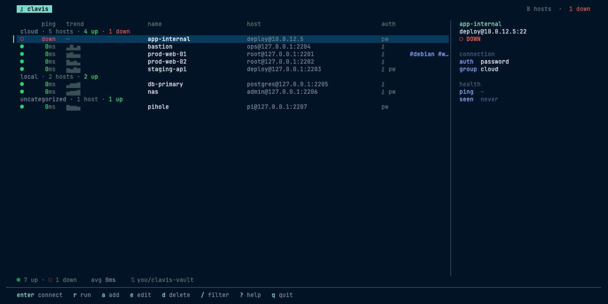
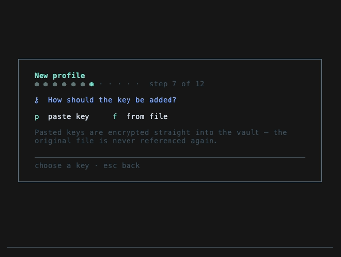

# clavis

An SSH connection manager with an encrypted credential vault, live reachability probes, and guarded encrypted git sync.

Clavis walks you through a step-by-step profile wizard to record SSH hosts, with a connection-test step. Passwords and private keys live in an age-encrypted vault; keep its master key outside the machine. Shared TCP probes show reachability and latency, separately from credential readiness and authentication results. Git sync checks allowed paths and encrypted-file headers, but metadata and scripts remain plaintext: never put secrets in those fields. The UI uses the Night Owl palette and can import supported settings from ~/.ssh/config.



The add-profile wizard asks one question at a time; saving a pasted private key writes encrypted vault data, without a plaintext staging file. External OpenSSH sessions have a separate temporary-key handoff described in [Security](docs/SECURITY.md):



## Install

macOS and Linux (needs git, Go 1.26.5+, and the OpenSSH client — the installer offers to install anything missing via your package manager, with confirmation). One line:

```bash
curl -fsSL https://raw.githubusercontent.com/armtch-dev/clavis/main/install.sh | bash
```

Re-running the same command updates every clavis already on your PATH.
Installs to `/usr/local/bin` if writable, otherwise `~/.local/bin`. From a
checkout, `./install.sh` does the same. Or manually:

```bash
go build -o clavis . && mv clavis ~/bin  # or wherever is in your PATH
```

No pre-built releases yet; everything builds from source. The macOS Keychain
unlock source is Mac-only; on Linux use `CLAVIS_KEY_FILE` or the prompt.

## First Run

Just launch it:

```
clavis
```

On first launch a welcome screen offers two paths:

- **`n` — new vault**: generates your master key and shows it once—it looks like `AGE-SECRET-KEY-1…`. Press `c` to copy it to the clipboard for pasting into a password manager (then clear the clipboard), and store it somewhere outside this machine. Clavis does not create a plaintext master-key file; optional Keychain/FIDO unlock stores a protected local copy.
- **`r` — restore**: setting up a machine you already have a clavis repo for? Paste the repo URL and a GitHub token, clavis fetches your metadata and encrypted credentials, then paste the master key from your original setup to unlock it. Profiles, scripts, settings, and credentials all come back; the token is stored encrypted on this machine only. After that unlock, clavis offers optional local auth: enrolling a FIDO2 security key if one is plugged in, or caching the key in the Keychain on macOS.

On subsequent runs, clavis tries these sources before the manual key prompt
(Keychain can request device-owner authentication):

1. `CLAVIS_KEY` environment variable (for scripts and CI)
2. `CLAVIS_KEY_FILE` environment variable (path to a file holding the master key)
3. macOS Keychain (opt-in; each read is gated by Touch ID / Apple Watch / password)

If none of those work and a FIDO2 security key is enrolled and plugged in, the unlock assertion starts by itself — touch the key and you're in. Otherwise you'll see an interactive prompt, where `tab` triggers the security-key unlock manually.

To cache the key in your login keychain (macOS only), press `k` on the first-run key screen, or unlock the vault once and toggle it in settings (`g`, then `k`). Reads are Touch ID-gated, but the key does move onto the machine; you decide.

To unlock with a YubiKey or other FIDO2 security key (macOS and Linux): install the fido2 tools (`brew install libfido2` / `apt install fido2-tools`), unlock once, then enroll in settings (`g`, then `f`). The master key is stored on this machine encrypted to a secret only a touch of that physical key can re-derive; see docs/SECURITY.md.

The Keychain cache and a security-key enrollment are alternatives to each other, never to the pasted master key: only one can be active per machine, and enabling one in settings replaces the other.

## Usage

### The TUI

The main interface is a list of SSH profiles. Keybindings:

| Key | Action |
| --- | --- |
| `enter` | Connect to the selected host |
| `r` | Run a script on the selected host (only scripts that apply; or paste and go) |
| `m` | Manage the script library (all scripts: create, edit, delete) |
| `a` | Add a profile (step-by-step wizard; paste a private key or point to a file) |
| `e` | Edit the selected profile (`enter` keeps any answer or stored credential as-is) |
| `d` | Delete the selected profile and its vault secrets |
| `t` | Test the connection (dial → handshake → auth → exec) |
| `h` | Review a changed host key after testing; type `trust` to confirm |
| `v` | Full connection details at any width; `c` copies target, `f` fingerprint |
| `ctrl+e` | Expand the current/last error; `c` copies, `d` dismisses |
| `D` / `X` | Resume / discard the retained script draft (this session only) |
| `y` | Identities: reusable credentials shared by many hosts |
| `s` | Sync now (guarded, encrypted git push) |
| `g` | Settings: GitHub token, repo, autosync, keychain |
| `i` | Import hosts from ~/.ssh/config |
| `c` | Set the selected host's category (inline, no wizard) |
| `o` | Toggle latency ordering within category groups |
| `/` | Filter profiles (case-insensitive substring search) |
| `j/k` or `↑/↓` | Move cursor up/down |
| `?` | Show help overlay |
| `q` or `ctrl+c` | Quit |

In profile/identity edits, `ctrl+f` opens the field selector and `ctrl+s` saves.
Script editors also save with `ctrl+s` (`ctrl+d` remains supported); `tab` and
`shift+tab` traverse fields. Escape retains one script draft in memory; `ctrl+n`
recovers a stale draft as a new copy. `ctrl+r` runs an unsaved script, or recovers
storage when a failed-write barrier is active. Scroll panels/help with
`pgup`/`pgdn`; Escape closes details/help. Settings `r` refreshes local-unlock
status and `v` shows the actual sync destination, last success, and pending/dirty state.

The field selector uses arrows or `j/k` (also Tab/Shift+Tab), with Home/End for
first/last; Enter jumps to the field, Escape/Ctrl+F closes it. In the wizard,
Tab advances except inside the key-paste textarea. Passwords and key passphrases preserve whitespace.
An empty edit keeps the stored password; choosing **keep stored key** discards
an abandoned replacement. Failed saves retain input. Existing edits whose
metadata or credentials changed elsewhere must be reopened; script drafts can
instead be recovered with Ctrl+N as a new copy. Drafts retain their original run
target and refuse execution if that target has changed.

After a storage failure, **Ctrl+R** reacquires storage, recovers pending writes,
and reloads a coherent snapshot. Review the result and explicitly retry; deletion
requires fresh confirmation. Recovery does not replay the failed action or
restore a committed backup automatically. Persistent errors remain available
through Ctrl+E even after the short footer expires. Escape cancels pending
connection preflight; Ctrl+C cancels work and quits.

For a changed host key, test with `t`, then `h` to review the full old/new
fingerprints. Verify them independently, type `trust`, and press Enter; Escape
cancels. In the wizard, `r` retests, `h` reviews, `b` goes back, and Enter/`s`
saves. Wizard trust approval affects only the draft until it is saved.

### SSH authentication and import

Direct sessions, tests and scripts use stored key passphrases and try the stored
password if key authentication is rejected. Setup is bounded and cancellable;
interactive/script runtime continues after setup until completion or cancellation.

Interactive **ProxyJump** uses native OpenSSH with a stored target key, including
a protected key and optional target-password fallback. Jump credentials/options
come from trusted OpenSSH configuration/agent/prompt providers; the jump retains
its original prompt environment. Target fallback uses a private one-use FIFO
askpass handoff, not password argv/environment values or a regular plaintext
password file. That route rejects NUL/CR/LF and passwords over 1,022 bytes.
Password-only ProxyJump and ProxyJump scripts are unsupported. Connection tests
still dial the target directly; background probes skip jump profiles.

Import supports literal Host aliases, case-sensitive wildcard/negated defaults,
first-value precedence, Include scope/globs, tabs/equals syntax, quotes/comments,
and case-preserved values for HostName, User, Port, IdentityFile and ProxyJump.
Only the first IdentityFile is represented. Relative user-config Includes resolve
from `~/.ssh`, including with a supplied main-file path. Wildcards supply defaults,
not generated hosts. `Match`, active ProxyCommand/canonicalization, `%`/`${…}`
expansion and `~user` paths are rejected; `ProxyCommand none` and
`CanonicalizeHostname no` are accepted. Unrelated options are ignored; import
does not execute configuration commands. Malformed supported syntax fails before
publication. Duplicate/invalid entries and missing/unreadable keys are reported;
metadata and successfully imported encrypted keys publish in one transaction.

### Identities

An **identity** is a reusable credential set — a username plus a password
and/or SSH key (with passphrase if the key needs one) — that any number of
profiles can authenticate with. Create one with `y` → `n` (same wizard as
profiles, minus the host questions), then in a profile's wizard the
**Credentials** step offers every identity alongside "this host's own
credentials". Identity-backed profiles resolve the username and secrets
live: edit the identity once (`y` → `enter`), and every bound host picks up
the change. Identity metadata syncs in `identities.json`; its secrets are
age-encrypted in `vault/` like everything else. Deleting an identity still
in use is refused until its profiles are rebound.

### Categories vs tags

Each host has one optional **category** — the list is always grouped by it:
think `cloud`, `local`, `work`. Hosts without a category collect under
`uncategorized` at the bottom. Set it in the profile wizard or, faster,
press `c` on a host and type it inline. `o` toggles how hosts are ordered
*within* each group: stored order, or latency (fastest reachable first).

**Tags** are separate: free-form labels used for filtering (`/`) and for
matching scripts to hosts. A host has one category but any number of tags.

### Running scripts

Press `r` on a host to open the run picker: it lists only the scripts that
apply to that host, `enter` runs one, and `n` lets you paste something ad hoc
(`ctrl+r` runs it once without saving). Creating, editing, and deleting live
in the script library instead — press `m` on the list to see every script
regardless of tags. Scripts are reusable snippets stored in `scripts.json`
(synced with your profiles, never secret material).

Scripts can be tagged with the same tags you put on profiles. A tagged script
only appears in the picker on hosts that share at least one of its tags
(case-insensitive); an untagged script is universal and shows up everywhere.
So `apt upgrade` tagged `#debian` is offered on every `#debian` host and none
of the others. Set tags in the script editor (`tab` cycles script → name →
tags; leave tags empty for a universal script). The host is preflighted first, then the terminal shows the
script's live output; when it finishes you get the exit code and clavis waits
for a keypress before returning to the list. Scripts are piped to `bash -s`
on the remote side (falling back to plain `sh`), so nothing is written to the
remote filesystem by the transport (the script's own commands may write files).
ProxyJump hosts aren't supported for script runs yet.

### CLI Subcommands

```bash
clavis doctor              # Health check: key, vault, git, ssh
clavis import [path]       # Import hosts from ssh_config (default ~/.ssh/config)
clavis vault rekey         # Rotate the master key (re-encrypts everything)
clavis vault reset         # Wipe all credentials, mint a new key (use if key is lost)
clavis uninstall           # Remove clavis and all local data (synced repo untouched)
clavis version             # Show version
clavis --dump-frame        # Debug flag: render a single frame and exit
```

### Rotation and local recovery

`clavis vault rekey` unlocks the old vault and **prepares** the new ciphertext
without replacing the live generation. Store the displayed new key externally,
then type `saved` and Enter to commit. Failed key output, EOF or another response
aborts preparation. On a commit/storage error, retain **both keys** and the local
journals; an error alone does not establish which generation is active.

Successful rotation removes the active FIDO enrollment: unlock with the new key
and re-enroll in Settings. Keychain is refreshed when it supplied the rekey unlock;
update environment/key files and other caches as applicable. Sync the rotation
before using the new key on other machines. The **old key still decrypts old Git
ciphertext** and the matching local backup; rotation does not revoke history.

The last committed transaction's ciphertext/metadata backup is retained locally
until the next validated nonempty transaction starts. Explicit restoration is
available through the internal `fstxn.Lock.RestoreLast` API, followed by a complete
reload; there is no user-facing restore-last CLI command. Preserve the directory
before further writes if you need assisted restoration. See [Security](docs/SECURITY.md)
for the recovery contract and limits.

## Sync Setup

Press `g` from the main list to enter settings.

1. **Add a GitHub token**: Generate a personal access token with `repo` scope at https://github.com/settings/tokens. Paste it when prompted. This token is stored locally (machine-only, never synced).

2. **Create or link a repository**: Clavis confirms before creating a private repository on your GitHub account. You can also point to an existing private repo.

3. **Enable autosync** (optional): Requests sync after changes. Manual sync is available via `s`; overlapping requests coalesce into one follow-up.

What gets synced: `profiles.json` (host metadata), `identities.json` (identity metadata), `scripts.json` (plaintext scripts), `config.json` (preferences), `vault.meta` (vault version + recipient + encrypted canary), and encrypted vault secrets (`vault/*.age`). Repository `.gitignore` and `README.md` are also allowlisted.

Clavis sync excludes the master-key caches, GitHub token, recovery journals and
everything in `local/`. Opt-in Keychain/FIDO copies remain machine-local.

Sync owns the config directory through Git operations and complete state reload;
mutations pause while it runs. Selection follows profile IDs. An unchanged
recipient keeps the unlocked identity; a changed recipient asks for the new key.
The selected URL reconciles `origin` and removes an obsolete push override.
Settings `v` shows Git's resolved push destination after an attempt, including
URL rewrites. Before resolution it may show the requested destination. Last
success is session-local and may refer to a previous destination; dirty is a
conservative local-change indication, not a live Git diff.

Conflicts/cancellation attempt a bounded rebase abort and retain local commits.
Read Ctrl+E details, preserve the directory, and resolve conflicts before retrying;
if abort fails, follow the reported Git recovery instructions. Unfinished merges/
rebases are refused. When different key generations both changed credentials,
sync refuses **before rebase/push** rather than producing mixed-generation data.
Keep both keys and directory copies, reconcile credentials into a chosen
generation with the matching keys, then retry. Repeated sync alone cannot resolve
this; do not reset or force-push away unsaved history. Other machines may need
their local token re-entered and FIDO re-enrolled after a remote rotation.

## Data Layout

Clavis stores everything in `~/.config/clavis`:

```
~/.config/clavis/
├── profiles.json           # Non-secret metadata (host, user, port, auth flags, tags)
├── identities.json         # Reusable identity metadata
├── scripts.json            # Plaintext script library; no secrets
├── config.json             # Sync settings, UI preferences
├── vault.meta              # Vault version, age recipient, encrypted canary
├── .gitignore              # Blocks local/ and plaintext key patterns
├── vault/
│   ├── <id>.pass.age       # Encrypted SSH passwords
│   ├── <id>.sshkey.age     # Encrypted SSH private keys
│   └── <id>.passphrase.age # Encrypted key passphrases
└── local/                  # Machine-local; gitignored
    ├── github-token.age    # Encrypted GitHub PAT
    ├── fido2.json          # Optional hardware-enrollment metadata
    ├── master-key.fido2.age # Optional hardware-wrapped master key
    ├── .clavis.lock        # Persistent advisory lock; do not unlink
    ├── .clavis-transaction.json # Pending recovery journal, when present
    └── .clavis-committed.json   # Last committed ciphertext/metadata backup
```

The `vault/` directory is synced to git (encrypted). The `local/` directory is not.

## Status Indicators

On the profile list, each row shows:

- **Dot**: Connectivity status
  - `●` green: latency <50ms
  - `●` yellow: latency <200ms
  - `●` red: latency ≥200ms
  - `○` red: host is down (TCP connection refused or timeout)
- **Latency**: The most recent round-trip time to the SSH port, or "down"
- **Sparkline**: Recent samples from a per-profile history of up to 30 results,
  narrowed to available space; failures show as crosses

Direct targets share one probe per distinct address, with at most **16 active
dial/banner exchanges**. Probes use TCP, require no root, and normally repeat
every 15 seconds after initial jitter. Consecutive failures back off to 30, 60,
120, 240, then 300 seconds; success resets the interval. Session suspension pauses
the whole shared address until every owner resumes. Shutdown cancels queued and
active work; retargeted/deleted profiles reject stale observations.

A green dot means TCP reachability, not authenticated SSH readiness. Jump rows say
`via jump` and are not probed. `v` shows credential/auth-test state, last-check age,
min/avg/max and the chart-scale explanation; the wide detail chart labels its
numeric scale and shows last-seen information for down hosts. Chart columns
are samples, **not evenly spaced time**, especially during backoff or suspension.

## Remediation and validation

[Remediation summary](docs/REMEDIATION_SUMMARY.md) maps all 21 review findings and
the additional UX/scale recommendations to implementation. The original
[application review](docs/APPLICATION_REVIEW.md) remains historical evidence.
[Validation handoff](docs/VALIDATION_HANDOFF.md) records prior checks, untested
paths and deliberately deferred UI/performance validation.

## Environment Variables

- `CLAVIS_KEY` — The master key identity string (AGE-SECRET-KEY-1…)
- `CLAVIS_KEY_FILE` — Path to a file containing the master key (one key per line, comments starting with #)
- `CLAVIS_CONFIG_DIR` — Override the config directory (default `~/.config/clavis`)
- `CLAVIS_BG` — Your terminal's background color as `#rrggbb`. Clavis normally asks the terminal for it and adapts the theme; inside tmux/screen that query can't get through and clavis falls back to plain ANSI colors. Set this (e.g. `export CLAVIS_BG="#5a5475"` for Fairyfloss) to get the full adaptive theme there too.
